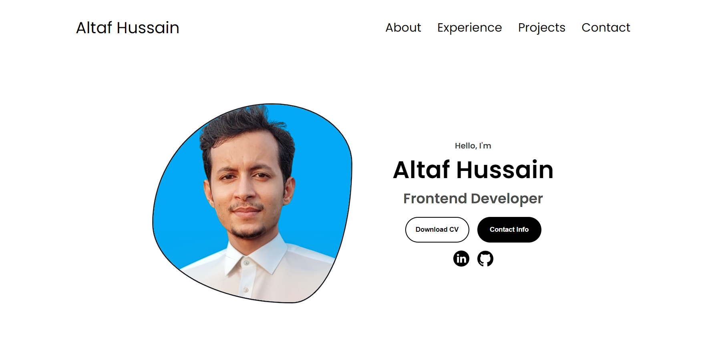

<h1 align="center">Personal portfolio</h1>

[](https://google.com)

My design portfolio to showcase a few projects. Built with [Vite](https://react.dev/) (a JavaScript build tool that can help you build React apps faster and more efficiently). View the [live site](https://iamaltaf786.github.io/Personal-Portfolio/).

## Install & run

Make sure you have nodejs `19.9.0` or higher and npm `9.6.3` or higher installed. Install dependencies with:

```bash
npm install
```

Once it's done start up a local server with:

```bash
npm run dev
```

## Permissions

I'm cool with anyone using the code or parts of the code for their own site, it is open source so people can learn from it and adapt it. However, I would encourage you to modify the theme and components it to make it your own. If you are using the site's design largely unmodified, I'd appreciate being credited as the designer of the website.

I do not give permission to present any of my projects as your own (this is being actively used as my portfolio site and these are my real projects I've worked on).
